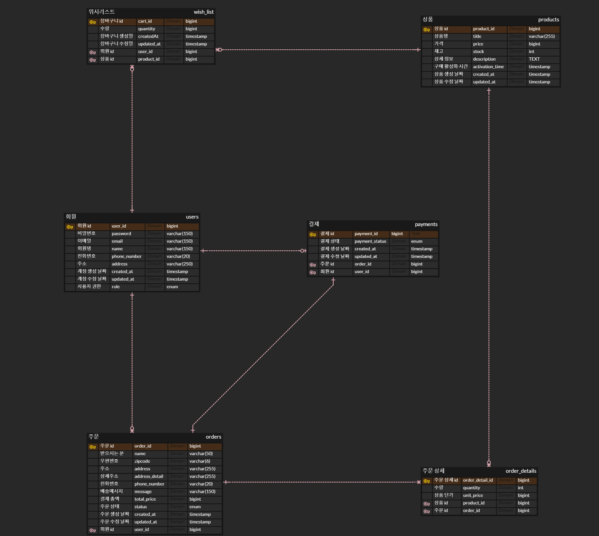
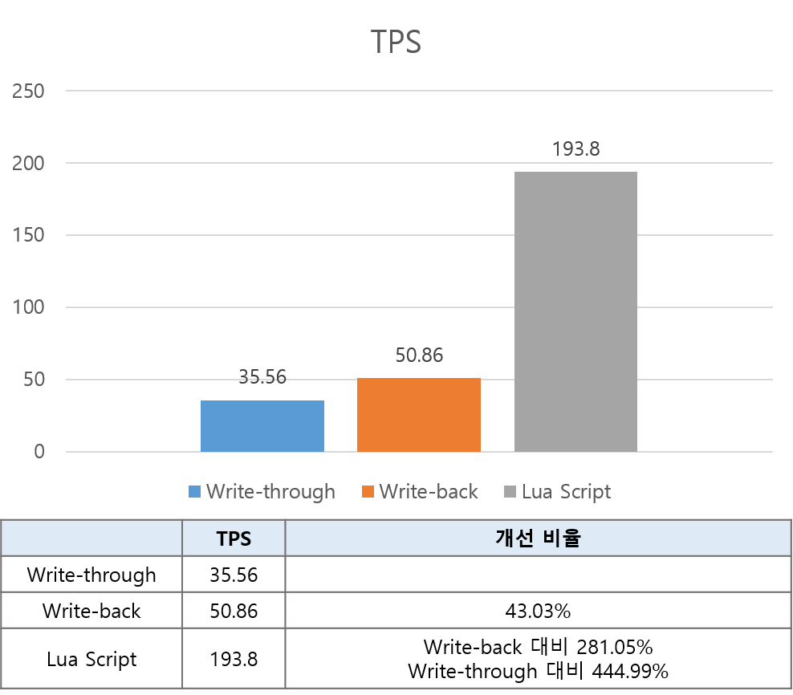

<h1>DEALSHOP</h1>
## **📝 프로젝트 소개** 
- 상품을 판매하고 구매할 수 있는 기능을 제공하는 E-commerce 플랫폼입니다. 
- 판매자는 판매 오픈 시간을 설정할 수 있으며, 구매자는 판매 기간 동안 **한정 수량 상품을 선착순으로 구매**할 수 있습니다.
- 특정 시간에 주문 요청이 몰리는 상황을 대비하여 **동시성 제어** 로직을 구현하였습니다.
- 마이크로서비스아키텍처(**MSA**)를 기반으로 서비스를 분리하여 유연하고 확장 가능한 시스템 구조를 구축하였습니다.  

### 📆 **개발 기간 및 인원**
- 기간: 24.08.07 - 24.09.03(1개월)
- 인원: 1인

### 🔧 **기술 스택**
**프레임워크 및 라이브러리**

    
    
    
    
    
    

**데이터베이스**

    
    

**메시지 큐**

    

**인프라**

    

### ⚙️ **개발 환경**
- Java 21
- Gradle
- Spring Boot 3.3.2

### 💻 **아키텍처 구성도**

## 📖 **ERD**

## 📑 **API 문서** 

## ✨ **주요 기능**
- **Kafka**를 활용한 이벤트 기반 상품 주문 시스템 구현
  - 비동기식 통신을 통한 서비스 간 결합도 감소
- **Redis 캐싱**을 활용한 상품 재고 관리
    - 데이터베이스 부하 감소 및 서비스 속도 향상
- **Spring Cloud OpenFeign**를 활용한 서비스 간 동기식 통신
- **API Gateway**를 활용한 라우팅 및 인가 기능 구현
- **Spring Scheduler**를 활용한 주문 상태 관리
  - 주기적인 주문 및 배송 상태 업데이트
- **Spring Security, JWT**를 활용한 인증 및 인가 구현
- Gmail SMTP를 활용한 이메일 인증 기능 개발
## 📊 **성능 최적화 및 트러블 슈팅** 

### Redis 캐싱를 활용한 상품 주문 성능 개선

 
  - 쓰기 전략: Write-through -> Write-back
  - Lua Script 적용
  - TPS: **35.56/sec** -> **193.80/sec**

### 실시간 재고 동시성 이슈 해결

### Kafka에서 하나의 토픽에 대해 복수 컨슈머 설정
- 문제 상황: **하나의 주문 취소 토픽**을 구독하는 상품 서비스와 결제 서비스 중 한 서비스만 메시지를 처리하는 문제 발생
- 해결 방법: 서비스마다 각각 **고유한 그룹 ID**를 부여해 독립적으로 메시지를 처리하도록 구현
